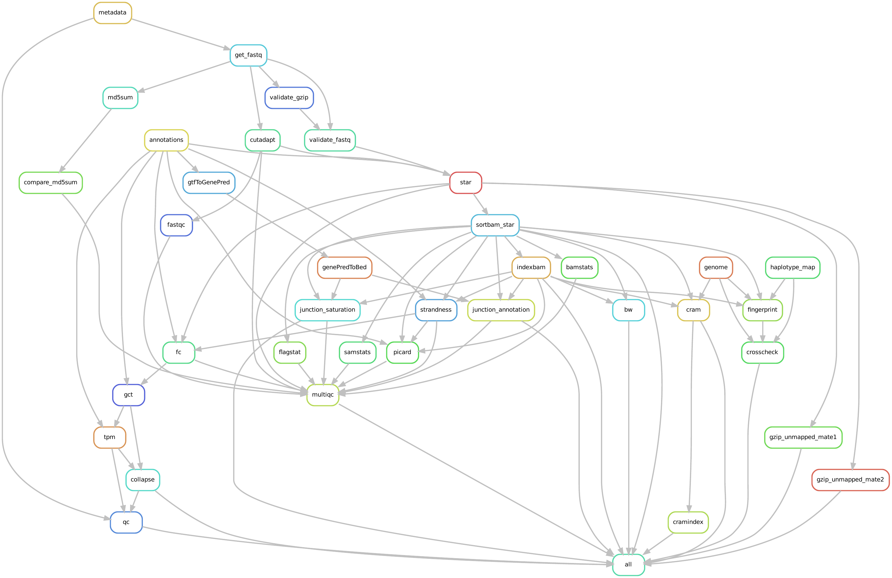

# bksnake

Public version of bksnake - biokit snakemake - bulk RNASeq Snakemake workflow

# Table of Contents
- [Introduction](#introduction)
- [Overview of the analysis workflow](#overview)
- [Requirements](#requirements)
- [Preparation](#preparation)
    - [Get pipeline](#get_pipeline)
    - [Reference genome](#reference)
        - [Human hg38](#reference_hg38)
        - [Other species](#reference_other)
    - [Metadata from file](#metadata_file)
- [Configuration](#configuration)
- [Usage](#usage)
- [Output](#output)
    - [Overview](#output_overview)
    - [Explanations](#output_explanations)


## Introduction ([top](#top)) <a name="introduction"></a>

_Snakemake_ ([Moelder et al., 2021](https://f1000research.com/articles/10-33/v1)) implements a bulk RNASeq data analysis workflow using _STAR_ aligner ([Dobin et al., 2012](https://academic.oup.com/bioinformatics/article/29/1/15/272537)) for read mapping and _FeatureCounts_ from the _Subread package_ ([Liao et al., 2014](https://pubmed.ncbi.nlm.nih.gov/24227677/)) for gene quantification. Reference genomes with _RefSeq_ and _Ensembl_ gene annotations are available for several species such as _hg38, chm13, mm10, mm39, rn6, rn7, mfa5, mfa6, ss11_, and _oc2_. The generation of these reference genomes and annotation files is documented in a separate repository that is currently under construction. Data quality and RNASeq metrics are determined using _FastQC_ ([Andrews et al.](https://www.bioinformatics.babraham.ac.uk/projects/fastqc/)), _MultiQC_ ([Ewels et al., 2015](https://academic.oup.com/bioinformatics/article/32/19/3047/2196507)), and _Picard_ tools ([Broad Institute](http://broadinstitute.github.io/picard/)). In addition, diagnostic plots for data quality assessment such as _BioQC_ tissue heterogeneity ([Zhang et al., 2017](https://bmcgenomics.biomedcentral.com/articles/10.1186/s12864-017-3661-2)) or _Principal Component Analysis_ are provided in an HTML report that is also currently under construction. Optionally, genome coverage files (_BigWig_) and read alignment files (_BAM/CRAM_) can be generated as well. Input read trimming with _Cutadapt_ ([Martin, 2010](https://cutadapt.readthedocs.io/en/stable)) and generation of _unmapped reads_ are also available. The pipeline can be launched via a helper tool, `run.py`, or directly with Snakemake for users familiar with the workflow tool. All parameters for the pipeline are specified within a configuration _yaml_ file or explicitly on the command line when using `run.py`. All input data, i.e. input fastq files, a human-readable tab-delimited file describing the samples, as well as the reference genome and STAR index files, must be available to the pipeline in a local data folder. To run the pipeline, Snakemake and [_Singularity_](https://sylabs.io/docs/) must be installed and pre-configured. All software tools used by the pipeline are pulled from public _Singularity_ or _Docker_ image repositories. It is recommended to run the pipeline on a high-performance cluster environment.


### Overview of the analysis workflow ([top](#top)) <a name="overview"></a>

Directed acyclic graph of a representative analysis workflow.

<div
  <figure>
    
    <figcaption>DAG of the workflow.</figcaption>
  </figure>
</div>


## Requirements ([top](#top)) <a name="requirements"></a>

This workflow requires the following tools in the system path

1. [Singularity](https://docs.sylabs.io/guides/main/user-guide/)
2. [Snakemake](https://snakemake.readthedocs.io/en/stable/)

In order to pull Singularity images from GitHub package registry one needs to specify username and GitHub read package token:

```bash
export SINGULARITY_DOCKER_USERNAME=<username>
export SINGULARITY_DOCKER_PASSWORD=<github read package token>
```


## Preparation ([top](#top)) <a name="preparation"></a>

### Get pipeline <a name="get_pipeline"></a>

Clone this repository to your local working directory

```bash
git clone https://github.com/bedapub/bksnake.git
```

### Reference genome <a name="reference"></a>

#### Human hg38 <a name="reference_hg38"></a>

Fownload prepared reference genome annotation files from [Zenodo](https://zenodo.org/record/8017214) into a genome "root" directory and "untar" the downloaded files there.
At the end, create symbolic link "hg38" pointing to the data folder for the human genome hg38 files.

```
genome_dir=<genome root directory>

mkdir -p $genome_dir
cd $genome_dir

wget https://zenodo.org/record/8017214/files/file.dat
tar –xvzf file.dat
ln -s genomes_2022-07-15_hg38 hg38
```

In folder `genomes_2022-07-15_hg38`, or `hg38`, are several subfolders containing `fasta` and `gtf` files for _RefSeq_ and _Ensembl_ annotations as well as index files for the _STAR aligner version 2.7.10b_.

```
<genome root directory>/hg38
├── fasta
├── gtf
│   ├── ensembl
│   └── refseq
├── star_2.7.10b
```

Specify the genome "root" directory in the pipeline configuration file (`config/config.yaml`), parameter `genome_dir` (see below).

#### Other species ([top](#top)) <a name="reference_other"></a>

Reference genomes of other species will be added later.


### Metadata ([top](#top)) <a name="metadata_file"></a>

The main input to the workflow is a tab-delimited text file containing metadata information about all samples. 
See an example file, `resources/test-data/metadata.txt`,  in the previously cloned pipeline directory.
The metadata file is composed of one header line and sample information on subsequent lines, one sample per line, organized by several columns as follows:

- `#ID`: unique sample label
- `GROUP`: name of sample condition
- `FASTQ1`: name of forward read fastq file (mate 1, R1)
- `FASTQ2`: name of reverse read fastq file (mate 2, R2)
- `Raw`: path to the folder containing the input fastq files
- `Organism`: Human, Rat, Mouse, or Pig

Note that columns `#ID` and `GROUP` may not contain white-spaces and other special characters.

It is possible to add more columns, for example, to describe additional experiment parameters or specimen information. But they are not used by the pipeline further.

#### Example ([top](#top)) <a name="metadata_file_example"></a>

| #ID        | GROUP       | FASTQ1                     | FASTQ2                     | Raw                       | Organism |
|------------|-------------|----------------------------|----------------------------|---------------------------|----------|
| GSM5362225 | HOXB9-KO    | 10k_SRR14749833_1.fastq.gz | 10k_SRR14749833_2.fastq.gz | resources/test-data/fastq | Human    |
| GSM5362224 | HOXB9-T133A | 10k_SRR14749832_1.fastq.gz | 10k_SRR14749832_2.fastq.gz | resources/test-data/fastq | Human    |
| GSM5362223 | HOXB9       | 10k_SRR14749831_1.fastq.gz | 10k_SRR14749831_2.fastq.gz | resources/test-data/fastq | Human    |


## Configuration ([top](#top)) <a name="configuration"></a>

The workflow requires several parameters to be configured, most of which can be set through a [`yaml`](https://en.wikipedia.org/wiki/YAML) configuration file.
A _template_ file named `config.yaml` is provided in the `config` directory.
It's recommended to create a local copy of the template and make modifications there.
Note that many of these parameters can also be specified through the wrapper script `run.py`, as explained in the next section.
Parameters specified on the command line through the wrapper script `run.py` will overwrite parameters set in the configuration file.

To learn about all possible parameters, execute:

```bash
python run.py --help
```

It is important to specify the following parameters in the `config.yaml`

- genome root and sub- directory: `genome_dir: VALUE`
- singularity images directory: `singularity: prefix: VALUE`
- snakemake path: `snakemake: path: VALUE`
- sample metadata file: `metadata: file: VALUE` and `metadata: group_name: VALUE`
- sequencing library: `library: type: VALUE` and `library: strand: VALUE`


## Usage ([top](#top)) <a name="usage"></a>

Run on a cluster with LSF scheduler, up to 100 jobs in parallel

```bash
python run.py --config <path to config.yaml> --jobs 100
```

Run locally, using up to 12 cores

```bash
python run.py --config <path to config.yaml> --cores 12
```
 
Run the pipeline with the **test data set** and specify four optional parameters on the command line
    
```bash
python run.py \
    --config config/config.yaml \
    --metadata-file resources/test-data/metadata.txt \
    --snakemake-path="ml purge && ml snakemake && snakemake" \
    --genome-dir /projects/site/pred/ngs/genomes \
    --outdir test-data_output \
    --jobs 50
```
    
By this, sample metadata, in particular the path for the raw input data, i.e. "fastq" files, are given by the input metadata file located at `resources/test-data/metadata.txt`.
The test data set consists of three sub samples fastq files from _A549 cell line_ samples from GEO study [GSM5362223](https://www.ncbi.nlm.nih.gov/geo/query/acc.cgi?acc=GSM5362223).
By the above command, the Snakemake jobs will be submitted to the cluster queue, and a maximum of _50 jobs_ will be processed simultaneously.
All output will be written to a new folder named `test-data_output`.
All other pipeline configuration parameters will be used from the default config template file, `config/config.yaml`.


## Output ([top](#top)) <a name="output"></a>

### Overview <a name="output_overview"></a>

Folder structure of a typical workflow run (* = optional output, + = Roche version only).

```
├── annot                            genome annotation files
├── bam*                             read mappings in BAM format (optional)
├── bw*                              read coverage BigWig files (optional)
├── config.yaml                      workflow configuration file
├── cram*                            read mappings in CRAM format (optional)
├── cutadapt*                        Cudapapt output (optional)
├── fastq*                           copy of input reads (optional)
├── fastqc                           FASTQC output files
├── fc                               FeatureCounts output files
├── gct                              gene counts and normalized gene counts in GCT file format for RefSeq annotations
├── gct-ens                          gene counts and normalized gene counts in GCT file format for Ensembl annotations
├── log                              log and output files from the tools used
├── multiqc_data                     MultiQC data files for RefSeq annotations
├── multiqc_data_ensembl             MultiQC data files for Ensembl annotations
├── multiqc_report_ensembl.html      MultiQC report for Ensembl annotations
├── multiqc_report.html              MultiQC report for RefSeq annotations
├── qc                               some QC plots, e.g. PCA or BioQC
├── rulegraph.pdf                    workflow DAG in pdf format
├── rulegraph.png                    workflow DAG in png format
├── samples.txt                      sample metadata in tab-delimited file
└── unmapped*                        unmapped reads in FASTQ file format (optional)
```


### Explanations ([top](#top)) <a name="output_explanations"></a>

### "annot" folder

Contains copies of reference genome and annotations files (i.e. `FASTA`, `GTF`, etc)
In addition, sample metadata in tab-delimited text file, `phenoData.meta` and in [`cls`](https://software.broadinstitute.org/cancer/software/gsea/wiki/index.php/Data_formats#CLS:_Continuous_.28e.g_time-series_or_gene_profile.29_file_format_.28.2A.cls.29) format `phenoData.cls`.

### "bam" folder (optional)

Contains all aligned reads in [`BAM`](https://en.wikipedia.org/wiki/BAM_(file_format)) file. Only generated if the parameter `keep_bam_files` is `True` in the pipeline configuration.

### "bw" folder (optional)

Read coverage files in [BigWig](http://genome.ucsc.edu/goldenPath/help/bigWig.html) format. May be used for graphical visualisation of the genome coverage by external tools such as [JBrowse](https://jbrowse.org/jb2/docs/user_guide/) or [IGV](https://software.broadinstitute.org/software/igv/userguide). Only generated if the parameter `generate_bw_files` is `True` in the pipeline configuration.

### "cutadapt" folder (optional)

Output files from the sequencing read trimming tool [`Cutadapt`](https://cutadapt.readthedocs.io/en/stable/). Only generated if the parameter `cutadapt: run` is `True` in the pipeline configuration.

### "config.yaml" file

All configuration parameters stored in a single [`yaml`](https://en.wikipedia.org/wiki/YAML) file.

### "cram" folder (optional)

Contains all aligned reads in [`CRAM`](https://en.wikipedia.org/wiki/CRAM_(file_format)) file. Only generated if the parameter `generate_cram_files` is `True` in the pipeline configuration.

### "fastq" folder (optional)

Contains a copy of the input [`FASTQ`](https://en.wikipedia.org/wiki/FASTQ_format) files. Only generated if the parameter `keep_fastq_files` is `True` in the pipeline configuration.

### "fastqc" folder

Contains all output files from the read quality control tool [`FastQC`](https://www.bioinformatics.babraham.ac.uk/projects/fastqc/).

### "fc" folder

Intermediate output files, summary and compressed counts file, from the gene quantification step by using [`FeatureCounts`](https://subread.sourceforge.net/featureCounts.html) tool from the [`Subreads`](https://subread.sourceforge.net/) package. Parameters for `FeatureCounts` can be specified via the input configuration file.

### "gct" folder

Contains _RefSeq_ annotated gene counts, normalized counts, _log2_-transformed counts in [`GCT`](https://software.broadinstitute.org/software/igv/GCT) file format.

- `refseq_count.gct`: RefSeq gene counts
- `refseq_count_collapsed.gct`: RefSeq gene counts collapsed to human orthologous gene symbols (using `resources/geneids.chip`)
- `refseq_tpm.gct`: normalized RefSeq transcript per million mapped reads (tpm)
- `refseq_tpm_collapsed.gct`: human orthologs of normalized counts (tpm)
- `refseq_log2tpm.gct`: log2-transformed normalized RefSeq transcript per million mapped reads (tpm)

### "gct-ens" folder

Contains _Ensembl_ annotated gene counts, normalized counts, _log2_-transformed counts in [`GCT`](https://software.broadinstitute.org/software/igv/GCT) file format.

- `ensembl_count.gct`: Ensembl gene counts
- `ensembl_count_collapsed.gct`: Ensembl counts collapsed to human orthologous gene symbols (using `resources/ENSEMBLGENES.chip`)
- `ensembl_tpm.gct`: normalized Ensembl transcript per million mapped reads (tpm)
- `ensembl.gct`: human orthologs of normalized counts (tpm)
- `ensembl_log2tpm.gct`: log2-transformed normalized RefSeq transcript per million mapped reads (tpm)

### "log" folder

Contains several log files from analysis tools used by the pipeline. Mainly used for debugging purposes.

### "multiqc_data" folder

Output files from the [`MultiQC`](https://multiqc.info/docs/) tool with _RefSeq_ gene annotations (e.g. for Picard RNASeq metrics).

### "multiqc_data_ensembl" folder

Output files from the [`MultiQC`](https://multiqc.info/docs/) tool with _Ensembl_ gene annotations (e.g. for Picard RNASeq metrics).

### "multiqc_report_ensembl.html" file

HTML summary report from the [`MultiQC`](https://multiqc.info/docs/) tool based on _Ensembl_ genome annotations.

### "multiqc_report.html" file

HTML summary report from the [`MultiQC`](https://multiqc.info/docs/) tool based on _RefSeq_ genome annotations.

### "qc" folder

Plots for quality control purposes.

- `bioQC.pdf`: Heatmap representationg of the _BioQC_ enrichment scores for detecting detecting such tissue heterogeneity ([Zhang et al. 2017](https://bmcgenomics.biomedcentral.com/articles/10.1186/s12864-017-3661-2))
- `bioQC_thr2.txt`: _BioQC_ enrichment scores above threshold 2
- `bioQC.txt`: All _BioQC_ enrichment scores 
- `refseq_log2tpm_pca.pdf`: Plot of the main components from the principal component analysis on the basis of the _log2_-transformed normalized _RefSeq_ gene counts (log2tpm).
- `refseq_log2tpm_pca.txt`: Coordinates of the components from the principal component analysis on the basis of the _log2_-transformed normalized _RefSeq_ gene counts (log2tpm).

### "rulegraph.pdf" and "rulegraph.png" files

Graphical representation of the entire workflow. A directed acyclic graph, DAG, generated by [`Snakemake`](https://snakemake.readthedocs.io/en/stable/)

### "samples.txt" file

Tab-delimited, human readable text file containing study and sample metadata in tabular form (one sample per line).

### "unmapped" folder (optional)

Contains unmapped sequencing reads in [FASTQ](https://en.wikipedia.org/wiki/FASTQ_format) files. Only generated if the parameter `generate_unmapped` is `True` in the pipeline configuration.

([To the top of the page](#top))
